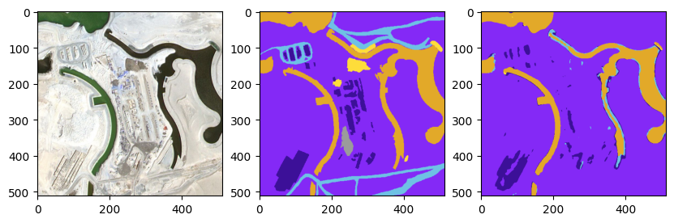
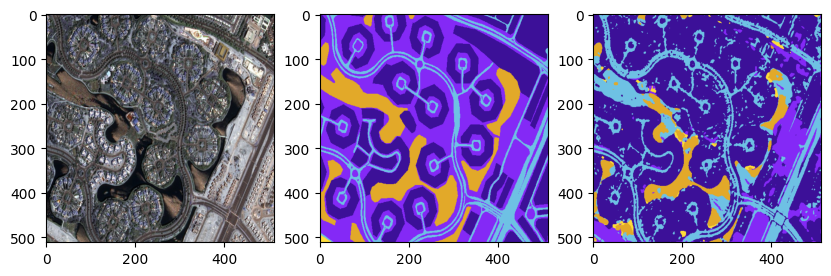
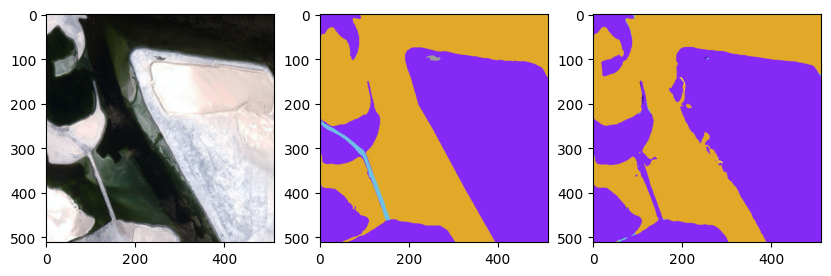

## Transformers For Vision

This repo contains some sample codes for doing certain vision related tasks.

1. A template toolkit for maintaining quality repo
2. An `infinite dataloader` for a classification dataset
3. A `data loader for semantic segmentation` tasks
4. `UNet model` for semantic segmentation with `Vision Transformer` backbone
5. Training script for UNet segmentation model
6. Inference script for segmentation model
7. Sample `automated hyperparameter tuning` script using Optuna

### Sample predictions:

First image is the actual image resized to 512 X 512,
 second image is the ground truth mask,
and the third one is the model predicted mask.

    Dice score : 0.8472

    Dice score : 0.5612

    Dice score : 0.9517

Note: *The current model is trained from scratch for 10 epochs
on MacBook air M1 with just 64 training images and 8 validation images.
The results can be improved by training the model for longer and
also with some minimal hyperparameter tuning.*

### Off the shelf tools and components used:

- Programming Language
 
Python 3.10
- Neural Network framework:
 
PyTorch 1.13
- Environment reproducibility:
 
[Poetry](https://python-poetry.org/)
- Configuration management:
 
  [Hydra](https://hydra.cc/docs/intro/)
- Static Code quality checks:
 
[pre-commit](https://pre-commit.com/)
 
   - Black
   - Flake8
   - isort
   - pydocstring
   - mypy
   - Makefile
- Unit test:
 
[pytest](https://docs.pytest.org/en/7.2.x/)
- Code version control:
 
git

- Data and model version control:
 
[dvc](https://dvc.org/)

- Logging:
 
Python logging module

- Hyper Parameter Tuning:
 
[Optuna](https://optuna.org/)

#### TODO:
- [ ] Integrate [MLFlow](https://mlflow.org/) for experiment tracking
- [ ] Add unit tests for modules other than dataloader
- [ ] Add more models that can be plugged in for different applications

#### Reference:
1. Classification dataset used
https://www.kaggle.com/datasets/mahmoudreda55/satellite-image-classification
2. Segmentation dataset used
https://www.kaggle.com/datasets/humansintheloop/semantic-segmentation-of-aerial-imagery
